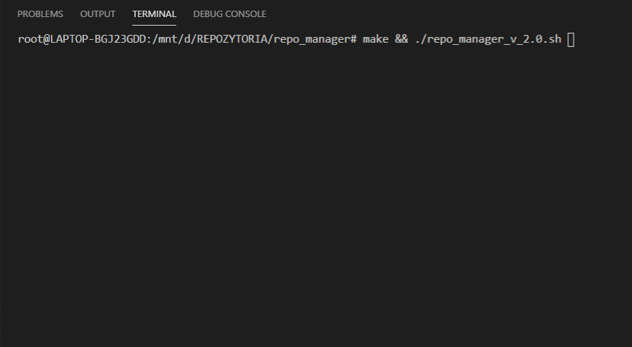

# Repo Manager

Repo Manager for a lecrurer.

Gather Exam Repo forks in recpective catalogs for each student.

Run scripts on them, make batch installs, fire tests...

... whatever you wish to hack time with it :)

## Exam using forks

Sey you have a `GROUP` with bunch of students that have github logins:

`YaNusH`, `tomaSh`, `jesika`, `brajan12`,

and an exam `EXAM` repo with signature:
`GROUP_EXAM_REPO__00`

Let them fork and create pull request to this repo.

## Config

You can collect every pull request based on setup provided in `lib/config.sh`

just confugure:

- `Github logins`
- `List of repo names`
- `Group signature`

## How to use

You need `make` installed.

Just run:

`$ make && ./repo_manager_v_2.0.sh`

# Development

## TBD..

# Based on

### Lecturers and Mentors

> Inspired by bash script [@beniaminrychter](https://github.com/beniaminrychter)

... other contributions welcome :)

### bash-project

An example of how a larger bash script can be splitted into into multiple files

Checkout here:
[https://github.com/zinovyev/bash-project](https://github.com/zinovyev/bash-project)

Kudos [@zinovyev](https://github.com/zinovyev) !

> Check out `README_bash-project.md` for details on how to build
